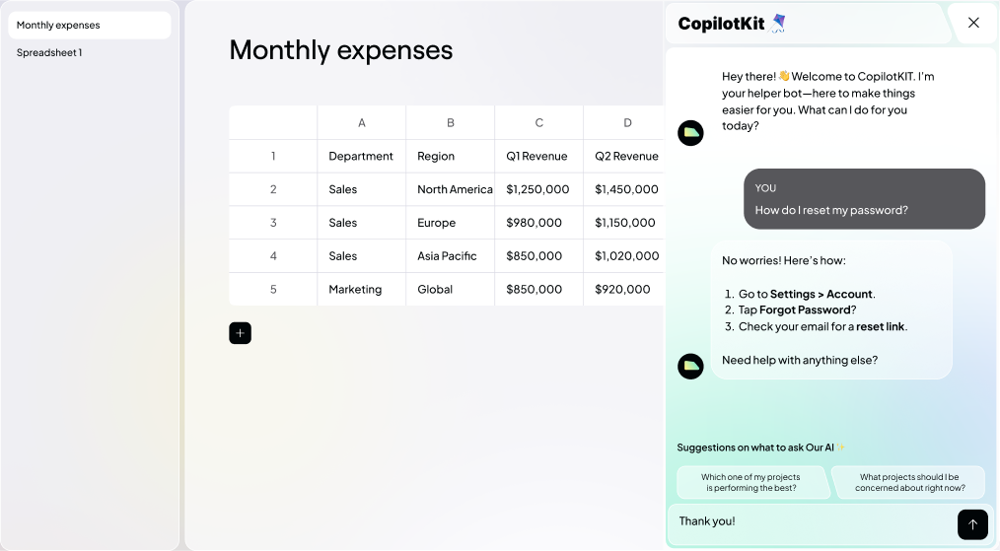

<link rel="preconnect" href="https://fonts.googleapis.com">
<link rel="preconnect" href="https://fonts.gstatic.com" crossorigin>
<link href="https://fonts.googleapis.com/css2?family=Plus+Jakarta+Sans:ital,wght@0,200..800;1,200..800&family=Spline+Sans+Mono:ital,wght@0,300..700;1,300..700&display=swap" rel="stylesheet">

This is a demo that showcases using CopilotKit to build an Excel like web app.

## Run the live demo

Want to see CopilotKit in action? Click the button below to try the live demo.
<div style="width: 100%; display: flex; flex-direction: column; gap: 12px; justify-content: center;">
  <a href="https://spreadsheet-demo-tau.vercel.app">
    
  </a>

  <a href="https://spreadsheet-demo-tau.vercel.app" style="margin: auto; text-decoration: none; padding: 12px 32px; background-color:#57575B; border-radius: 999px; display: flex; justify-content: center; align-items: center; gap: 12px; width:fit-content">
    
    <span style="font-family: 'Spline Sans Mono', monospace; font-weight: 500; font-size: 14px; line-height: 14px; letter-spacing: 0px; color: #FFFFFF;">RUN DEMO</span>
  </a>
</div>

## Deploy with Vercel

To deploy with Vercel, click the button below:

[](https://vercel.com/new/clone?repository-url=https%3A%2F%2Fgithub.com%2FCopilotKit%2Fdemo-spreadsheet&env=NEXT_PUBLIC_COPILOT_CLOUD_API_KEY,TAVILY_API_KEY&envDescription=By%20setting%20the%20TAVILY_API_KEY%2C%20you%20control%20whether%20the%20web%20search%20capabilities%20are%20enabled.%20Set%20it%20to%20NONE%20to%20disable%20this%20feature.&project-name=copilotkit-demo-spreadsheet&repository-name=copilotkit-demo-spreadsheet)

## How to Build: A spreadsheet app with an AI-copilot

Learn how to create a powerful spreadsheet app using CopilotKit. This tutorial will guide you through the process step-by-step.

Tutorial: [How to Build: A spreadsheet app with an AI-copilot](https://dev.to/copilotkit/build-an-ai-powered-spreadsheet-app-nextjs-langchain-copilotkit-109d)

## Getting Started

### 1. install the needed package:

```bash
npm i
```

### 2. Set the required environment variables:

copy `.env.local.example` to `.env.local` and populate the required environment variables.

> ⚠️ **Important:** Not all users have access to the GPT-4 model yet. If you don't have access, you can use GPT-3 by setting `OPENAI_MODEL` to `gpt-3.5-turbo` in the `.env.local` file.

### 3. Run the app

```bash
npm run dev
```

Open [http://localhost:3000](http://localhost:3000) with your browser to see the result.

You can start editing the page by modifying `app/page.tsx`. The page auto-updates as you edit the file.

### 4. Use the Copilot

TODO add details what to do as a user

## Zoom in on the CopilotKit code

1. Look for `/api/copilotkit/route.ts` and `/api/copilotkit/tavily.ts` - for the research agent integrated into the spreadsheet

2. Look for `useCopilotReadable` to see where frontend application context is being made accessible to the Copilot engine

3. Search for `updateSpreadsheet`, `appendToSpreadsheet`, and `createSpreadsheet` to see application interaction hooks made available to agents.

## Learn More

To learn more about CopilotKit, take a look at the following resources:

- [CopilotKit Documentation](https://docs.copilotkit.ai/getting-started/quickstart-chatbot) - learn about CopilotKit features and API.
- [GitHub](https://github.com/CopilotKit/CopilotKit) - Check out the CopilotKit GitHub repository.
- [Discord](https://discord.gg/6dffbvGU3D) - Join the CopilotKit Discord community.
